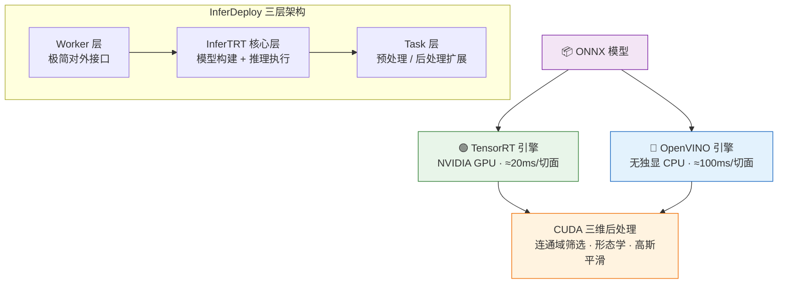
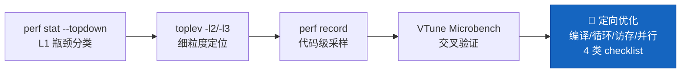

<h1 align="center">Chang Chiang · 高性能计算工程师</h1>

- 📫 Email: [Chang_Chiang@outlook.com](mailto:Chang_Chiang@outlook.com)
- 🐙 GitHub: [Chang-Chiang](https://github.com/Chang-Chiang)
- 🔭 Focus: C++ Image Processing · HPC · Model Deployment
- 🌐 在线简历: [GitHub Pages](https://chang-chiang.github.io/Chang-Chiang/)

---

**📑 目录**

- [🔍 概览](#sec-overview)
- [🛠 核心技术栈](#sec-techstack)
- [💼 工作经历](#sec-work)
- [🚀 项目经历](#sec-projects)
- [📊 GitHub Stats](#sec-stats)

---

## 🔍 概览

- 🧰 **开发经验**：Linux 平台 C++ · **2 年**医疗影像设备领域，算法工程化落地经验丰富
- ⚡ **性能优化**：TMA 剖析 + SIMD/CUDA/多线程 · **9.6x** 加速（1621ms → 168ms）
- 🧠 **模型部署**：TensorRT/OpenVINO 双引擎 · GPU **≈20ms**/切面，主导开源框架 [**InferDeploy**](https://github.com/Chang-Chiang/InferDeploy)

## 🛠 核心技术栈

- **编程语言**：   
- **开发环境**：    
- **性能分析**：   
- **性能优化**：      
- **推理框架**：  

## 💼 工作经历

### 深圳开立生物医疗科技股份有限公司 · 软件工程师

*🗓 2024.04 – 2026.09*

- **算法工程化**：Matlab/Python 仿真方案 C++ 工程化落地，独立完成超声图像处理模块开发，推进模块化重构与技术文档沉淀
- **性能优化**：TMA 定位热点，SIMD 向量化 + 多线程并行 + 访存优化，ATI 整帧 1621ms → 168ms（**9.6x**）
- **推理部署**：主导超声主机 TensorRT 与 CUDA/cuDNN 多版本兼容性调研及推理环境搭建

## 🚀 项目经历

### 医学图像处理算法性能优化

*🗓 2024.06 – 2024.12*

     

- **成果**：目标平台 i3-1115G4E 上 ATI 整帧耗时 1621ms → 168ms（**9.6x**），满足临床实时处理需求
- **剖析驱动**：VTune 全链路 TMA 剖析定位 Memory/Core Bound 瓶颈，按热点占比逐级实施优化
- **多层优化手段**：手写 SSE/AVX2 intrinsics；CUDA + cuFFT 批量化、前后处理 kernel 常驻显存；MKL DFTI 替代 `cv::dft`（948ms → 118ms、**8x**）；TBB 多线程；二维前缀和使 ROI 累加内存流量降低 160 倍；LTO 链接优化
- **跨平台与正确性**：OpenCL 覆盖 Intel/AMD/NVIDIA 无独显设备；分级验证规范——逻辑等价要求逐位一致、浮点重排允许 ulp 级差异

📊 剖析驱动优化闭环流程图（点击展开）

 

### 深度学习推理部署：CT/MR 关键切面检测与脏器分割

*🗓 2025.01 – 2025.04* | [🐙 InferDeploy](https://github.com/Chang-Chiang/InferDeploy)

   

- **框架**：开源 InferDeploy 三层推理框架（Worker–InferTRT–Task），新任务仅重写预处理/后处理即可接入、零改核心代码
- **双引擎落地**：同一 ONNX 模型按设备自动选择 TensorRT GPU（≈20ms）或 OpenVINO CPU（≈100ms）引擎，覆盖 YOLO 关键切面检测与 UNet 脏器分割两任务
- **CUDA 三维后处理**：分割掩膜重建体数据 → 最大连通域筛选 → 3D 形态学开闭 → 3D 高斯平滑，支撑体积统计与三维可视化
- **吞吐与工程质量**：FP32/FP16/INT8 多精度 + INT8 校准链路（COCO 验证）；GPU 预处理 + 多 Stream 异步重叠提吞吐；RAII + `shared_ptr` 资源管理、六级日志与计时组件

🏗 双引擎部署架构图（点击展开）

 

### 性能分析与优化：知识体系与 TMA 实战（开源项目）

*🗓 2024.06 – 至今* | [🐙 Performance-Analysis-And-Tuning](https://github.com/Chang-Chiang/Performance-Analysis-And-Tuning)

      

- **知识体系**：27 篇技术文档 + 200 份 before/after 对照示例，覆盖性能度量 → 单核（ILP/DLP）→ 访存 → 并行的全链路
- **TMA 实战**：perf-ninja 16 项优化实验，加速比 1.14x ~ 70x（伪共享 15.8x、依赖链消除 20.9x、AVX2 15.1x、算法优化 70x）
- **方法论反哺**：完整 TMA 分析流水线 + 4 类优化 checklist，直接支撑"医学图像处理"项目 9.6x 加速落地

🧭 TMA 分析流水线图（点击展开）

 

## 📊 GitHub Stats

  <picture>
    <source media="(prefers-color-scheme: dark)" srcset="https://github-profile-trophy.vercel.app/?username=Chang-Chiang&theme=github-dark&no-frame=true&column=7"/>
    
  </picture>

  <picture>
    <source media="(prefers-color-scheme: dark)" srcset="https://github-readme-stats.vercel.app/api?username=Chang-Chiang&show_icons=true&hide_border=true&theme=github_dark"/>
    
  </picture>
  <picture>
    <source media="(prefers-color-scheme: dark)" srcset="https://github-readme-stats.vercel.app/api/top-langs/?username=Chang-Chiang&layout=compact&hide_border=true&theme=github_dark"/>
    
  </picture>

<!---
Chang-Chiang/Chang-Chiang is a ✨ special ✨ repository because its `README.md` (this file) appears on your GitHub profile.
You can click the Preview link to take a look at your changes.
--->
